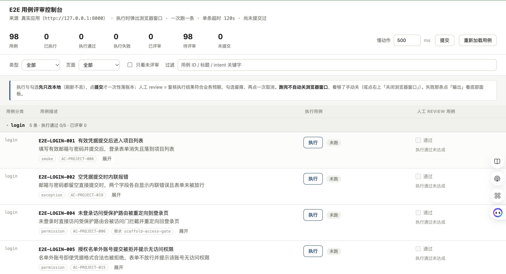

# Atlas — 工业级 Spec-Driven 全流程 Vibecoding 工作流

> **“没有应然资产约束的 AI 编码，写得越快，烂尾越彻底。”**  
> Atlas 为大模型驱动的工程开发构建了一套**项目级应然资产治理引擎与机器硬门禁系统**。覆盖「立项 → 需求 → 应然资产 → 实现 → 验收 → 收口」全生命周期，全部活在业务仓库内，跨项目分发、机器强校验。

---

## 目录

- [一、快速开始（Quick Start）](#一快速开始quick-start)
- [二、独门重器：E2E 用例评审控制台（人机协同终验）](#二独门重器e2e-用例评审控制台人机协同终验)
- [三、为什么需要 Atlas？（破局 Vibe Coding）](#三为什么需要-atlas破局-vibe-coding)
- [四、核心架构：两层正交模型](#四核心架构两层正交模型)
- [五、核心武器库：三环与唯一编排件（apply）](#五核心武器库三环与唯一编排件apply)
- [六、技术纵深：代码图谱（Code Graph）优化逆向抽取](#六技术纵深代码图谱code-graph优化逆向抽取)
- [七、防线淬炼：变异证明（Mutation Proving，门禁真的会咬人）](#七防线淬炼变异证明mutation-proving门禁真的会咬人)
- [八、硬核断言哲学：抗伪造、累加链与 testid 薄桩](#八硬核断言哲学抗伪造累加链与-testid-薄桩)
- [九、铁血门禁系统（The Iron Gates）](#九铁血门禁系统the-iron-gates)
- [十、自带技能生态（Built-in Skills & Agents）](#十自带技能生态built-in-skills--agents)
- [十一、可选外脑增强：Obsidian 决策中枢哲学](#十一可选外脑增强obsidian-决策中枢哲学)
- [十二、开源协议（License）](#十二开源协议license)

---

## 一、快速开始（Quick Start）

### 1. 依赖准备
* **Python 3.10+**（核心校验器与生成引擎）
* **Playwright**（E2E 测试运行器：Python 或 Node 版）
* **Trellis**（推荐宿主执行器，负责需求级任务调度）
* *(可选)* **CodeGraphContext (cgc)**：若需开启图谱级跨文件逆向分析，安装 `pip install codegraphcontext`

### 2. 全局安装 CLI 与项目初始化

```bash
# 全局安装 Atlas CLI
npm install -g atlas-workflow

# 进入你的项目目录
cd your-project

# 一键初始化并装配 Atlas 工作流（自动探测平台、下发 Skills 与契约）
atlas init
```

装配命令将自动完成：
1. 将核心契约、校验器、模板整包镜像至目标项目 `.atlas/`；
2. 为你的 Agent 平台生成专用 Skills 瘦桩（`atlas-structure`, `atlas-prd`, `atlas-e2e`, `atlas-apply`, `atlas-grill`, `frontend-design` 等）；
3. 向 `.trellis/workflow.md` 注入 `Phase 1.6` 锚点补丁与执行提示；
4. 部署只读审查专用 Agent：`atlas-reviewer`。

### 3. 配置技术栈画像 (`product/stack-profile.yaml`)
检查并填写生成的画像草稿：
```yaml
product: MyAwesomeApp
origin: greenfield          # greenfield: 全新项目 | adopt: 存量老项目接入

apps:
  - name: web
    path: frontend
    role: landing           # landing: 当前主实现
  - name: api
    path: backend
    role: landing

e2e:
  runner: python-playwright
  app_base_url: http://127.0.0.1:8000
  review: null              # null = 默认使用会话模型；可配置备用模型做交叉审查

graph:                      # 可选：开启代码图谱后端优化逆向
  backend: cgc
```

### 4. 怎么快速使用？（纯自然语言驱动）

Atlas 完全做到了**“日常全自动，低频全靠大白话”**：

#### 场景 A：存量老项目首次接入（最常用）
在 Agent 对话中输入一句大白话：
```text
“帮我把这个项目接入 Atlas 工作流”
```
Agent 将自动调用 `atlas apply adopt`，逆向扫描现有代码拓扑，建立应然资产起点（不瞎猜老业务用例，只登记基线）。

#### 场景 B：全新空白项目立项
对 Agent 说：
```text
“跑一下三环全量构建，建立应然基线”
```
Agent 自动调用 `atlas apply all`，全量串行初始化 `structure → prd → e2e`。

#### 场景 C：日常迭代提需求（100% 自动无感）
你**无需敲任何 Atlas 命令**，像往常一样在 Trellis 中创建任务（如 `/trellis:start 优化配音列表`）：
* 工作流在 Phase 1.6 **自动静默调用** `apply <需求ID>` 完成应然资产编译；
* 需求写完收口时，自动触发钩子刷新最新代码事实。

#### 场景 D：一键体检与门禁自检
随时可在终端跑一条命令检查全项目应然资产与门禁状态：
```bash
atlas check --fast
```

---

## 二、独门重器：E2E 用例评审控制台（人机协同终验）

绝大多数 AI 编程工具最大的谎言就是“测试全绿了”。黑盒运行的无头脚本或者 Agent 自称的“已通过”，根本无法保证界面交互真的符合人类直觉。

Atlas 随包自带了一个**纯 Python 标准库编写的本地轻量级可视化服务 —— E2E 用例评审控制台**：

```bash
启动命令：atlas console    # （或直接执行 python3 .atlas/scripts/e2e_console.py）
访问地址：http://127.0.0.1:4190
```

<p align="center">
  
</p>

### 控制台核心功能与交互哲学：
1. **真实应用有头执行（Headed Slow-Mo）**：
   * 点击单条用例的「执行」按钮，立刻弹起真实浏览器窗口，以可配置的慢动作（默认 `500ms` 慢速回放）逐步点击、输入、交互。人类可以肉眼看清按钮是否跳动、样式是否错位、跳转是否顺畅。
2. **“执行通过”才解锁“人工 Review”**：
   * 只有当 Playwright 脚本在真实应用中跑出绿色通过态，右侧的「人工 Review 通过」复选框才会真正解锁；
   * 杜绝脚本红灯但人类盲目打勾，也杜绝脚本绿灯但界面视觉崩塌的伪通过。
3. **单并发隔离与故障现场保留**：
   * 同时严禁并发执行两条，防止数据相互污染；
   * 跑完后**不自动关闭浏览器窗口**，留足时间给人类检查 DOM 现场；单条失败时，底面板直接输出断言报错日志。
4. **单写者架构与提交落盘（Append-Only Ledger）**：
   * 页面上的每一次执行和打勾先且仅保存在浏览器本地（`localStorage`，刷新不丢）；
   * 只有人类审视完毕、点击全局**「提交」**按钮时，才**一次性原子写入**：
     * 向 `product/e2e/reviews/console/events.jsonl` 追加一条不可篡改的事件快照；
     * 派生人读的 `ledger.md` 评审账本；
     * 原子回写总索引 `product/e2e/e2e-index.md` 的状态列。

---

## 三、为什么需要 Atlas？（破局 Vibe Coding）

在纯粹依赖 Agent 自由发挥的 AI 辅助编程（Vibe Coding）中，开发者普遍会遇到难以逾越的工程瓶颈：

1. **上下文截断导致历史失忆**：长周期会话一旦被总结压缩，模型会遗忘上一轮方案为什么这么选，甚至反复推翻既有架构；
2. **“伪完成”幻觉（False Pass）**：模型宣称“功能已全部实现”，实际上只写了前端表单，未落持久化存储；或者仅凭 Toast 弹窗自证成功；
3. **单源事实坍塌**：接口契约、代码实现、测试用例散落在不同角落，修好 A 坏了 B，代码越写越腐败；
4. **形式主义审查**：让生成代码的同一个 Agent 自己审查代码，审查结果永远是“毫无问题”。

**Atlas 的破局哲学**：
* **应然资产前置**：在写业务代码之前，先通过机器可检验的形式写死“这个功能怎么算做对了”；
* **眼见为实的验收**：用可视化控制台拉起真实浏览器慢动作回放，必须人类亲眼复核通过才允许勾选验收；
* **机器替代人眼**：凡是“两边必须一致”的逻辑（testid 应然 ⇔ 实然、AC ⇔ 用例覆盖、影响面预测 ⇔ 真实提交 diff），全由自动化测试与验证器判定，拒绝人脑死记；
* **严格隔离的独立复审**：探索与验证分离、实现与审查分离、跨进程只读独立挑刺。

---

## 四、核心架构：两层正交模型

Atlas 将软件工程严格解耦为互不嵌套的两个正交平面：

```
┌─────────────────────────────────────────────────────────────┐
│                 项目级：应然资产层（Atlas 辖区）                 │
│  结构基线（代码图谱逆向） ──► 项目级 PRD（业务 AC） ──► E2E 验收总索引与分片 │
└──────────────────────────────┬──────────────────────────────┘
                               │  单向编排原语：atlas apply <需求ID>
                               ▼  （应然资产先长出来，前置而非后补）
┌─────────────────────────────────────────────────────────────┐
│                 需求级：任务执行层（执行器辖区，如 Trellis）       │
│      需求卡 (Task) ──► 业务代码编写 ──► 单元测试 ──► 任务归档      │
└─────────────────────────────────────────────────────────────┘
```

1. **项目级（应然资产层）**：定义“这个系统是什么、长什么样、怎么算做对”。包含**结构事实**（图谱与 AST 逆向抽取）、**项目级 PRD**（业务规则单源）与 **E2E 验收用例**（真实靶场可证伪用例）。
2. **需求级（任务执行层）**：定义“这次改动改什么、怎么写代码”。由宿主执行器（当前标配 **Trellis**）承担，Atlas 本身**不侵入业务代码实现**。
3. **`apply` 单向衔接**：需求在进入实现前，必须先调用 `atlas apply <需求ID>` 将需求增量合并入项目级应然资产，坚决杜绝“先写代码、事后补文档”的失控循环。

---

## 五、核心武器库：三环与唯一编排件（apply）

Atlas 的核心由 **三环（Rings）** 与 **一个跨环编排件（Apply）** 构成：

| 构件 | 角色 | 产物位置 | 核心机制 |
|---|---|---|---|
| **Ring 1: 结构基线** (`atlas-structure`) | **实然事实** | `.trellis/spec/structure/` | 代码图谱 + AST 逆向提取代码事实（路由、数据模型、API、测试现状）。事实区由机器刷新，语义区由规范治理，双份维护（`current` / `legacy`）。 |
| **Ring 2: 项目级 PRD** (`atlas-prd`) | **业务应然** | `product/prd/` | 业务叙事单一真相源（SSOT）。双向强制追踪链：`功能 ──► 业务规则 ──► 验收准则(AC) ──► E2E 用例`。不挂实现状态，保持应然纯粹性。 |
| **Ring 3: 验收用例** (`atlas-e2e`) | **验证应然** | `product/e2e/` | 真实应用单段执行（Playwright）。总索引唯一入口，一例一片（页面分片），以 `data-testid` 为唯一硬锚，严禁将瞬时反馈（Toast）当终态。 |
| **Orchestrator: 跨环编排** (`atlas-apply`) | **编排引擎** | 任务卡 / 报告 | 唯一的增量流水线。负责将具体需求前置编译为应然资产更新，运行全部机器门禁，形成执行闭环。 |

---

## 六、技术纵深：代码图谱（Code Graph）优化逆向抽取

传统基于纯 AST 或静态正则的代码分析，存在致命局限：**只能看见单文件内的语法树，看不懂跨文件的调用拓扑与隐式依赖**。在复杂工程中，重构一个底层数据模型，传统的 linter 根本无法推断上游究竟有多少路由受损。

Atlas 引入了**图谱后端隔离层（`adapters/_graph.py`）**，接入基于 **CodeGraphContext (cgc / FalkorDB 知识图谱后端)** 的图分析能力：

```
  Git 仓库代码 (FastAPI/React/...)
               │
               ▼  cgc 逆向索引 (FalkorDB)
  ┌──────────────────────────────────────────────┐
  │         全仓代码知识图谱 (Code Graph)          │
  │  File ──► Class ──► Function ──► Caller/Callee │
  └──────────────────────┬───────────────────────┘
                         │
        ┌────────────────┴────────────────┐
        ▼                                 ▼
 结构事实抽取器 (adapters)          精准影响面推导器 (impact_report)
 • 跨文件端点到模型映射             • 需求前置推导影响域
 • 级联依赖自动归域                 • 结合 git diff 深度校验
```

### 图优化的 4 大工程设计：
1. **薄后端、厚自有**：
   * 图谱引擎只当“哑索引与高速查询接口”；所有智能影响面分层、业务域聚类等算法全部由 Atlas 自有 Python 脚本实现。后端无论换成 FalkorDB、Neo4j 还是内存图，核心业务逻辑稳如泰山。
2. **用前现刷，拒绝陈旧（Freshness Guarantee）**：
   * 图谱没有后台常驻的定时任务。每个脚本在查询图谱前自动调用 `ensure_index()`，比对当前 `git HEAD + 脏文件集` 的哈希摘要；哈希不一致则秒级重构索引，**过期状态在消费时构造性不存在**。
3. **确定性查询（Deterministic Ordering）**：
   * 图谱层的所有 Cypher/SQL 查询强制追加 `ORDER BY`，保证在同一代码状态下跑出的图谱关系绝对确定，确保上层资产可 diff、可对账。
4. **优雅降级，Fail-Open 保护**：
   * 若外部未安装图谱后端，隔离层自动探测并降级为纯 AST/正则模式，并以显式 `WARN` 告警，绝不破坏基础构建流程。

---

## 七、防线淬炼：变异证明（Mutation Proving，门禁真的会咬人）

很多 CI 门禁最大的隐患是：**代码写错了，校验器永远返回 PASS，人以为自己有防线，实际上形同虚设。**

Atlas 坚持**变异证明（Mutation Proving / M 系列钉子测试）**原则：
* **门禁自身必须证明自己会咬**：编写任何一条新校验规则，必须同步提交故意注入破坏性脏数据的“变异测试用例”（M1~M43 系列钉子）；
* **自洽门与双向红灯验证**：
  * 变异测试人工制造各种边界事故：字段缺失、双向差集、静默截断、假冒通过、未声明退役；
  * 只有在变异数据下门禁**百分之百响亮报红**，这条规则才被允许合入出厂检验套件（280+ tests）；
  * 杜绝任何“永远绿灯的摆设门禁”。

---

## 八、硬核断言哲学：抗伪造、累加链与 testid 薄桩

在生成与执行自动化测试方面，Atlas 建立了一整套经实战锤炼的硬核规范：

### 1. 结果断言硬口径（抗瞬时反馈与跨真相源断言）
* **禁止拿瞬时反馈自证成功**：Toast 提示弹窗消失、弹窗关闭、按钮加载状态恢复，**一律不得算作断言通过**（前端可能只写了个假定时器）；
* **写操作必须刷新后复断言**：新建、编辑、删除动作完成后，测试脚本必须**强制重新刷新页面**，从服务端拉取真实持久化数据再次校验；
* **跨真相源断言**：断言必须落在与被操作控件**不同的视图**（如在表单点保存，必须到全局列表或只读详情页断言值变化），防止局部内存假更新。

### 2. 累加链测试与播种解耦（`declare` vs `enforce`）
* **累加链难题**：在长业务流中（创建草稿 ──► 录音 ──► 调优 ──► 导出），传统 E2E 每次重置数据库会瞬间炸毁前序步骤的状态；
* **双模播种解耦**（`seed.mode`）：
  * `enforce`（常规独立模式）：每条用例运行期执行数据库种子重置；
  * `declare`（累加链专属模式）：种子声明仅参与静态数据模型对账（确保字段存在），**不在运行期发射破坏性重置**，完美支持带 Delta 差量断言的链式业务测试。

### 3. `testid` 薄桩机制（Thin Stubs Injection）
* **解决跨目录认知成本**：写前端代码的 Agent 经常因不知道有哪些 `data-testid` 而乱起名字；
* **自动注入上下文**：Atlas 从用例分片中自动提取该页面的全部应然 `testid`，编译为小巧的 `.trellis/spec/conventions/testid.md` 薄桩文件，通过 Trellis 原生机制直接注入到 Agent 的写代码上下文中，实现两端零心智对齐。

---

## 九、铁血门禁系统（The Iron Gates）

在 Atlas 中，“代码写完了”不取决于 Agent 的自述，而取决于**机器对账门禁（Hard Gates）**：

```
                ┌──────────────────────────────────┐
                │ 走查单确认门 (人侧: UI 旅程拍板)   │
                └─────────────────┬────────────────┘
                                  ▼
                ┌──────────────────────────────────┐
                │ 环间独立审查门 (机器: 拦截 Critical)│
                └─────────────────┬────────────────┘
                                  ▼
   [实现阶段] ──► ┌──────────────────────────────────┐
                │ 实例 ⑤ 实现审查门 (只读进程 diff 审查)│
                └─────────────────┬────────────────┘
                                  ▼
                ┌──────────────────────────────────┐
                │ 双向对账门 (testid 实然 ⇔ 应然集合) │
                └─────────────────┬────────────────┘
                                  ▼
                ┌──────────────────────────────────┐
                │ impact 对账门 (预测影响面 ⇔ git diff)│
                └─────────────────┬────────────────┘
                                  ▼
                             [收口归档]
```

1. **`testid` 双向集合对账门 (`validate_testids.py`)**：
   * **断言**：用例分片中声明的应然 `testid:` 清单，与前端源码中真实扫描出的 `data-testid` **按页面双向集合严格相等**。漏写控件报 FAIL，多写无用埋点报 FAIL。
2. **实例 ⑤：实现代码 ⇔ 应然资产独立审查（防偷工减料）**：
   * 需求实现后、归档前，由独立进程执行只读 diff 审查；
   * **应审 N / 实审 M 严格对账**：实测表明大模型审查大体积 diff 时会悄悄跳过文件；若实际评审文件数 `M < N`，无论结论如何一律报红拒绝，发现 `Critical` 缺陷一票否决。
3. **impact 预测对账门 (`impact_reconcile.py`)**：
   * 在需求规划时预测的影响面集合，与收口时的真实 `git diff` 变更文件列表自动比对差集，持续校准模型的架构感知力。
4. **设计档案豁免 ⇔ 检测器双向对账 (`validate_design_exemptions.py`)**：
   * 设计档案中的豁免理由必须与代码扫描器中的忽略规则双向集合相等，关掉报警必须有台账，杜绝任何暗箱私货。
5. **装配版本完整性门 (`.atlas/VERSION`)**：
   * 目标项目中的装配态与 Atlas 源包内容哈希实时对账，源码更新未重新同步时响亮报警。

---

## 十、自带技能生态（Built-in Skills & Agents）

Atlas 随包完整分发了一套自洽的高阶开发与评审套件：

### 1. `atlas-grill` — 决策压力测试与代价刺破
* **拒绝做题疲劳**：告别动辄抛出 5 个常识选择题导致用户麻木点击“全选推荐”；
* **单轮严控 1~2 问**：只问真正不可逆、存在尖锐 Trade-off 的致命卡点；
* **红蓝刺痛摊牌**：模型给出深思熟虑的主选方案，但**残酷亮出该方案最恶心的刺痛代价与后续反噬**，逼问人类是否认账；
* **代码矛盾核验**：方案与既有代码事实矛盾时直接指出，逼问是否推翻既有架构。

### 2. `atlas-design-review` & `atlas-reviewer` — 独立复核架构
* **只审不改**：审查者 Agent（`atlas-reviewer`）工具集不含写文件与 bash 权限， fresh context 进程隔离；
* **串行两道机制**：重大方案定稿前，先跑 `atlas-grill` 进行前沿刺探，拍板后再由 `atlas-design-review` 独立复核，确保无暗箱隐式假设。

### 3. `frontend-design` — 前端品味总监与合规基线
* **两层合一**：第一层提供设计语言与审美旋钮（variance / motion / density）；第二层提供严格的 Web 合规基线（42 份细则文件覆盖 WCAG 可访问性、对比度、Core Web Vitals、暗色模式）；
* 交付前由预检闸门强制走查，纯后端项目自动降级忽略。

### 4. §14 产物落笔纪律（零反刍与读者中立）
* 契约内置规范：所有需求文档、代码注释、Git 提交与 PR 说明，必须按**“读者从未看过会话工作过程”**书写；
* 会话中被否决的备选方案、反复纠正的过程属于会话控制数据，**严禁反刍进交付产物的正文与命名中**。

---

## 十一、可选外脑增强：Obsidian 决策中枢哲学

> **知识库是可选增强：未配置时全局优雅降级（PASS），不阻断任何环。**

如果你拥有 **Obsidian**（配合卡片盒知识库后端），你可以为 Atlas 接入真正的**长期决策外脑**。

```
┌─────────────────────────────────┐       ┌─────────────────────────────────┐
│     Git 仓库（单一代码真相源）    │       │     Obsidian Vault（决策中枢）   │
│                                 │       │                                 │
│  • 当前事实：现在的代码长什么样    │ ◄───► │  • 时间轴纪要 (3508)：为什么这么做 │
│  • 现在的 PRD 与验收用例         │ 对账门 │  • 决策结论 (3507)：拍板定案归档   │
│  • 纯正向陈述，不留历史纠葛      │       │  • 未决台账 (3509)：跨会话开放问题 │
└─────────────────────────────────┘       └─────────────────────────────────┘
```

### 1. 代码库与知识库的清晰分工
* **Git 仓库存“现在的实然与应然”（What）**：代码库只写正向终态，不需要记录每次反复扯皮的历史；
* **Obsidian 存“为什么这么定”（Why）**：跨越几十天、涉及多位开发者或大模型长周期的决策心路、被否方案的历史教训、跨领域的未决问题台账，全部沉淀在知识库活页中。

### 2. 三卷合一长期记忆体系
* **3508 讨论纪要卷**：按轮次留痕关键纠正，新 Agent 会话一秒入场接盘；
* **3507 决策记录卷**：每项重大架构定案的不可逆依据；
* **3509 未决问题卷**：跨需求的开放问题台账，机器对账跟踪状态流转。

---

## 十二、开源协议（License）

本项目基于 **[GNU Affero General Public License v3.0 (AGPL-3.0)](LICENSE)** 协议开源。

---

<p align="center">
  <b>Atlas</b> — 让 AI 编程拥有工业级确定性。<br>
  Built with rigor. Governed by machines.
</p>
