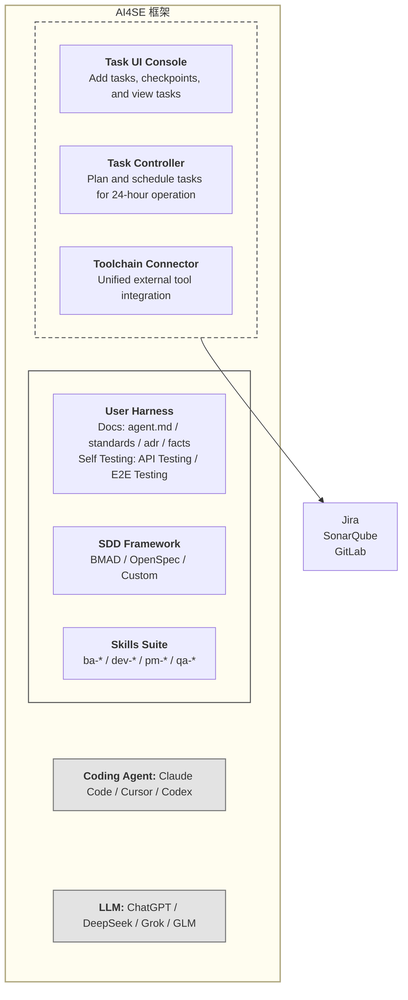

# AI4SE 框架

```mermaid
flowchart TB
    subgraph FRAME["AI4SE 框架"]
        subgraph R1[" "]
            direction LR
            A["`**Task UI Console**<br/>Add tasks, checkpoints, and view tasks`"]
            B["`**Task Controller**<br/>Plan and schedule tasks for 24-hour operation`"]
            C["`**Toolchain Connector**<br/>Unified external tool integration`"]
        end
        subgraph R2[" "]
            direction LR
            D["`**User Harness**<br/>Docs: agent.md / standards / adr / facts<br/>Self Testing: API Testing / E2E Testing`"]
            E["`**SDD Framework**<br/>BMAD / OpenSpec / Custom`"]
            F["`**Skills Suite**<br/>ba-\* / dev-\* / pm-\* / qa-\*`"]
        end
        subgraph R3[" "]
            G["`**Coding Agent:** Claude Code / Cursor / Codex`"]
        end
        subgraph R4[" "]
            H["`**LLM:** ChatGPT / DeepSeek / Grok / GLM`"]
        end
        R1 ~~~ R2
        R2 ~~~ R3
        R3 ~~~ R4
    end
    R1 --> EXT["Jira<br/>SonarQube<br/>GitLab"]

    style FRAME fill:#fffdf0,stroke:#b0a880,stroke-width:2px
    style R1 fill:none,stroke:#555,stroke-width:1.5px,stroke-dasharray:6 4
    style R2 fill:none,stroke:#555,stroke-width:1.5px
    style R3 fill:none,stroke:none
    style R4 fill:none,stroke:none
    style G fill:#e3e3e3,stroke:#777,stroke-width:1.5px
    style H fill:#e3e3e3,stroke:#777,stroke-width:1.5px
```
