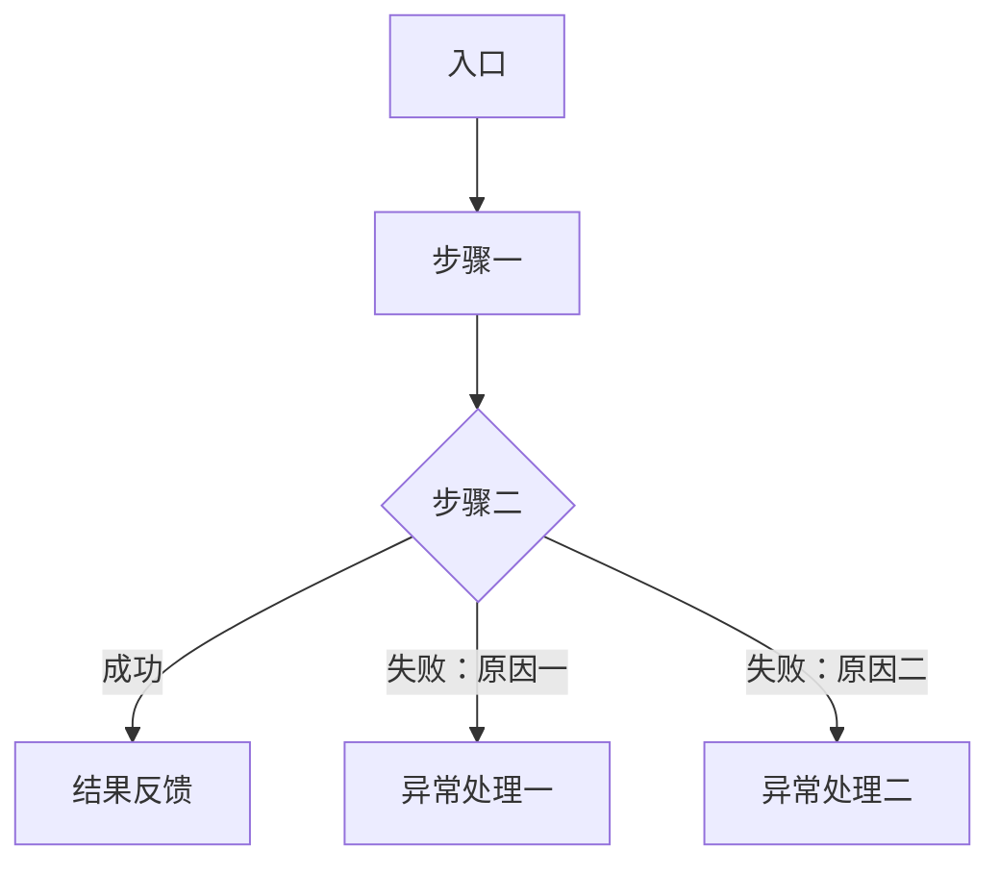

# [必填：域中文名] — 域级 PRD

> 本文件是**应然**文档，不挂实现状态。
> 对应 structure 模块与页面见 `product/prd/README.md` 的追溯总表。
>
> **两种形态（契约 §4）**：`origin: adopt` 的**首轮开户**用**开户最小集**——只写 一 域概述 / 二 功能清单 /
> 四 业务规则 / 五 验收标准 四节，**三 功能详细说明（六件套）与 六 Assumptions & Defaults 整节不出现**，
> 留到该域首次由 `apply <需求ID>` 增量时一次补齐；**章节号不重排**。其余场景用下面的**完整形态**。

- **In Scope**：[必填]
- **Out of Scope**：[必填]
- **依赖域**：[必填；无则写「无」]

---

## 一、域概述

| 项 | 内容 |
|---|---|
| 定位 | [必填：这个域解决什么问题] |
| 边界 | [必填：到哪里为止] |
| 上游 | [必填：依赖谁] |
| 下游 | [必填：谁依赖它] |

## 二、功能清单

| 功能编号 | 名称 | 说明 | 优先级 | 需求类别 |
|---|---|---|---|---|
| `FN-<CODE>-001` | [必填] | [必填：用户可完成…] | P0 / P1 / P2 | 功能性 / 非功能性 / 迁移性 / 约束 |

> 优先级：P0 = 必须上线 / P1 = 重要可延后 / P2 = 可选优化。
> **迁移性**必须先填写「owner」与「结束条件」（可写在功能描述里），并同步进全局「范围与处置 → 迁移性需求」。

## 三、功能详细说明

[必填：每个 P0/P1 功能一节，六件套齐全]

### 功能 1：<名称>

**功能描述**

[必填：用户在何处完成什么、解决什么问题]

**用户流程**（正常路径 + 全部异常路径）

**状态机**（无状态流转时写「不适用」+ 一句理由）

| 状态 | 进入条件 | 退出条件 | 用户可见表现 |
|---|---|---|---|
| [必填] | | | |

**字段规范**（业务语义；技术表结构引用 `structure/`，不在此重复）

| 字段名 | 类型 | 必填 | 长度限制 | 校验规则 | 错误提示文案 |
|---|---|---|---|---|---|
| [必填] | | | | | |

**文案规范**（六类场景必须齐全）

| 场景 | 文案 |
|---|---|
| 空状态 | [必填] |
| 加载中 | [必填] |
| 操作成功 | [必填] |
| 操作失败 | [必填] |
| 权限不足 | [必填] |
| 网络异常 | [必填] |

**异常处理**

| 异常场景 | 触发条件 | 处理方式 | 用户反馈 |
|---|---|---|---|
| [必填] | | | |

## 四、业务规则（Rule Set）

| 规则 ID | 规则内容 | 所属功能 | 触发条件 | 优先级 | 影响范围 |
|---|---|---|---|---|---|
| `<CODE>-R-001` | [必填：禁止「适当处理 / 合理展示 / 尽快」等模糊表达] | [必填：§二 的 `FN-*`，多个用 `、`] | | | |

> **双向追溯（机器门，契约 §5）**：每条规则必须在「所属功能」列声明它服务哪些功能（≥１）、必须被 ≥1 条 AC 回指；每个功能必须被 ≥1 条规则服务、且至少有一条 AC（经「功能 → 规则 → AC」传递）。
> AC 回指的规则必须**能从该规则的文本读出该 AC 的被测属性**；域内没有语义同族的规则时，**新增一条专属规则**（列在本表末尾），**不得**并入语义无关的既有规则（`3509 §B32`）。

## 五、验收标准

| AC ID | 场景（Given / When / Then） | 回指规则 |
|---|---|---|
| `AC-<CODE>-001` | Given [必填] / When / Then（含可量化指标） | `<CODE>-R-001` |

> 硬约束：每条规则 ≥1 条 AC；每条 AC 回指 ≥1 条规则；每个功能 ≥1 条 AC；
> `Then` 必须是可判定的确定断言，**不得断言实现**。
> 表列是机器判据（契约 §5）：三列形态（`AC ID` ｜ 场景 ｜ 回指规则），**不得**出现 `样例类型` 列（已移交 E2E 环，`3509 §B74`）。

#### 结构类 AC 清单

> 只放**被测属性只能在页面初始态观测**的 AC（页面骨架 / 默认面板 / 按数据渲染构成）。它们是 E2E 环
> 「零证据用例须挂结构类 AC」那道门的**唯一输入**；每个页面 / 面板都应有对应一条。其余 AC 不进本清单。
> **不得滥用**：该 AC 的 `Then` 只要能由真实界面动作改变，就不属结构类。

| AC ID | 为什么只能在初始态观测 |
|---|---|
| `AC-<CODE>-NNN` | [可选：无此类 AC 时留空表] |

## 六、Assumptions & Defaults

| 假设内容 | 采用的默认值 | 影响面 | 何时需要澄清 |
|---|---|---|---|
| [条件必填：有未证实但按此推进的假设时才写，不要留空表] | | | |

> **镜像字段先取证（契约 §6）**：字段取值域由外部系统决定（TTS / LLM / 存储 / 协议 / 第三方 SDK）时，
> 定稿前必须对该系统**取证**（参数名 + 取值域），结果写进本表并**注明被取证系统的版本**。禁止凭「常见做法」编词表。

## 七、变更记录

| 版本 | 日期 | 变更说明 |
|---|---|---|
| 0.1.0 | [必填] | 初稿 |

## 八、用户旅程走查

> **确认门（硬）**：本节须用户显式确认（保留下方「已确认」行）后才进 E2E 环；仅「改变应然 UI」的需求需要本节（`rings/e2e/reference.md` §6.2）。派生规则与覆盖判据见 `rings/prd/reference.md` §4·八。确认前对照 `product/design.md`（存在时）视觉方向一致性。

> [初稿无「已确认」行 = 未确认；重派生本节时必须删除旧的「已确认」行待重确认]

[每条旅程 = 一个用户目标，从功能六件套派生，不得新增六件套之外的行为：

### 旅程 N：<用户目标>（<功能编号>）

1. 入口：<页 / 路由> ⇒ <用户可见状态 / 文案>
2. <动作> ⇒ <可见反馈>
3. …

**终态**：<状态机落位>

覆盖判据：功能清单（§二）每条 FN ≥ 1 条旅程；跨页状态变化必须显式写出。]
