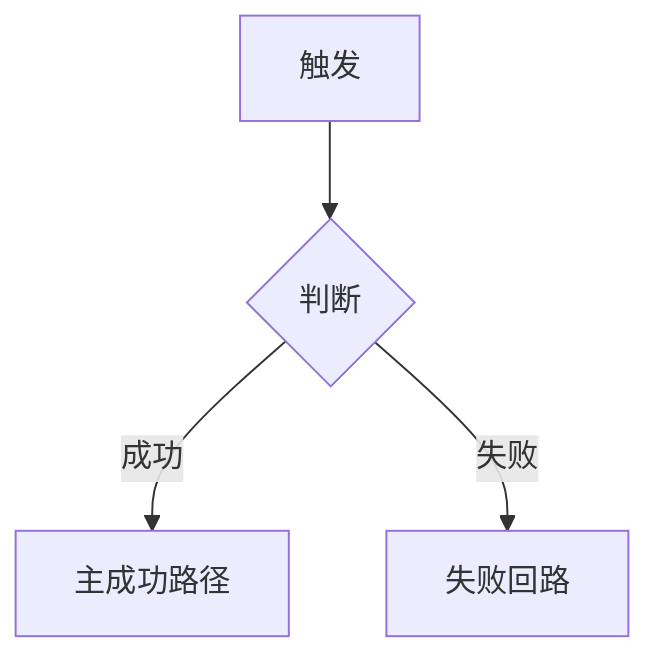

# [必填：产品名] — 产品需求文档（全局）

> 本文件是**应然**文档：只写产品应该是什么样，**不写实现进度、不挂状态**。
> 实现状态见 `.trellis/spec/structure/current/`，验收进度见 `product/e2e/`。

范围形态：首建

> **形态声明（必填，契约 §3）**：`首建` = 本产品**无对照基线**（§六 写功能范围表）；
> `变更` = **有对照基线**（外部旧系统 **或** 本产品上一版），须再加 `覆盖度：全量 | 增量起步` 与 `基线：<路径或版本>`，§六 改写处置表。
> `变更（增量起步）` 时只强制三节：**五 功能架构 / 六 范围与处置 / 七 页面结构全景**；未覆盖的部分在 `product/prd/README.md` 追溯总表里写 `未覆盖（沿用实然）`（合法值，不是占位符）。

## 目录

[必填：生成后列出各章锚点]

---

## 零、待决策登记

> 本表非空时，**不产出域级 PRD**。每行必须填满，不得写"待定"。

| # | 议题 | 现状取证（参考基线） | 建议默认值 | 影响面 | 决策人 |
|---|---|---|---|---|---|
| 1 | [必填：待产品方决定的事项] | [必填：从 structure 读到什么，带路径] | [必填：给出具体值] | [必填：影响哪些域/环] | [必填] |

---

## 一、产品定位

- **是什么**：[必填：一句话，避免营销词]
- **为什么做**：[必填：要解决的问题]
- **一句话价值**：[必填：对谁、带来什么]

## 二、目标用户与角色

| 角色 | 身份 | 核心目标 | 使用场景 | 使用频次 |
|---|---|---|---|---|
| [必填] | | | | |

## 三、核心场景

[必填：3–5 个端到端场景。每个场景一节，含 Mermaid 流程图，**必须画异常分支**]

### 场景 1：[场景名]

## 四、产品形态与入口

| 项 | 内容 |
|---|---|
| 平台形态 | [必填] |
| 主要入口 | [必填] |
| 导航骨架 | [必填] |

## 五、功能架构

| 域 slug | 中文名 | 一句话职责 | 域级文件 |
|---|---|---|---|
| [必填] | | | `<domain>-prd.md` |

[必填：域间关系图；有依赖的域画箭头]

## 六、范围与处置 / 功能范围

> 下面两小节**按声明的形态只留一个**（`首建` → 6.1；`变更` → 6.2）。本节只管**功能能力级的得失**：
> 模块级 / 字段级 / 交互级的变化归各域 PRD 的「变更记录」与 `apply` 环，不写进本节。

### 6.1 功能范围（`范围形态：首建` 时）

| 功能 / 能力 | 所属域 | 一句话说明 |
|---|---|---|
| [必填：本产品规划的全部功能能力] | | |

### 6.2 功能处置（`范围形态：变更` 时；覆盖基线里的每一项能力，不得遗漏）

| 功能 / 能力 | 所属域 | 处置 | 理由 |
|---|---|---|---|
| [必填] | | 保留 / 改造 / 废弃 / 新增 | |

> `变更（增量起步）` 下本轮未触及的基线能力写 `未覆盖（沿用实然）`。

### 6.3 不做清单

| 明确不做的事 | 原因 |
|---|---|
| [必填] | |

### 6.4 迁移性需求

| 编号 | 内容 | owner | 结束条件 |
|---|---|---|---|
| [条件必填：存在迁移态时才写] | | | |

## 七、页面结构全景

### 7.1 导航层级

| 导航层级 | 页面名称 | 页面定位 | 入口 | 主要承载功能 |
|---|---|---|---|---|
| [必填] | | | | |

### 7.2 页面职责

| 页面名称 | 用户目标 | 关键内容/组件 | 空状态 | 异常状态 |
|---|---|---|---|---|
| [必填] | | | | |

### 7.3 页面 ↔ 域映射

| 页面 | 所属域 | 说明 |
|---|---|---|
| [必填] | | |

## 八、非功能需求

| 维度 | 要求 | 判定方式 |
|---|---|---|
| 性能 | [必填] | [必填：可量化] |
| 安全 | [必填] | |
| 兼容性 | [必填] | |
| 可维护性 | [必填] | |

## 九、术语表

| 术语 | 定义 | 备注 |
|---|---|---|
| [条件必填：有跨域共享术语时才写] | | |

## 十、风险与依赖

| 类型 | 内容 | 影响 | 应对 |
|---|---|---|---|
| 风险 | [必填] | | |
| 外部依赖 | [必填] | | |

## 十一、修订记录

> 不设修订记录的产品写一行 `不适用（理由：<一句>）` 即合法；**静默删除本节不合法**（契约 §3/§10）。

| 版本 | 日期 | 修订人 | 变更说明 |
|---|---|---|---|
| 0.1.0 | [必填] | | 初稿 |
